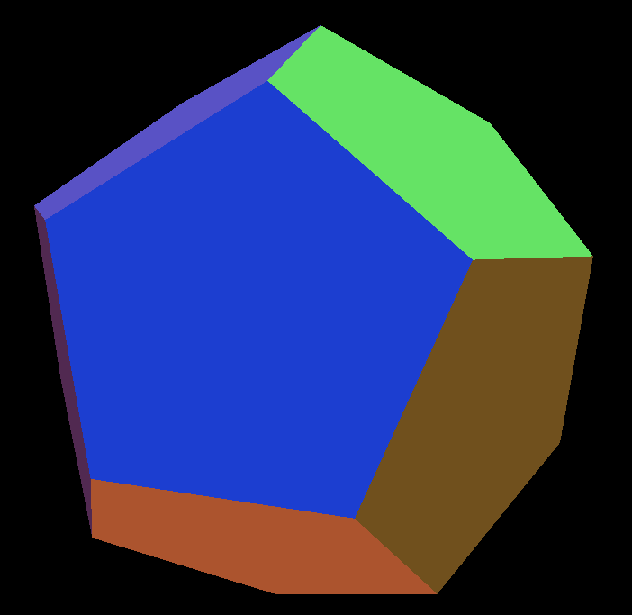
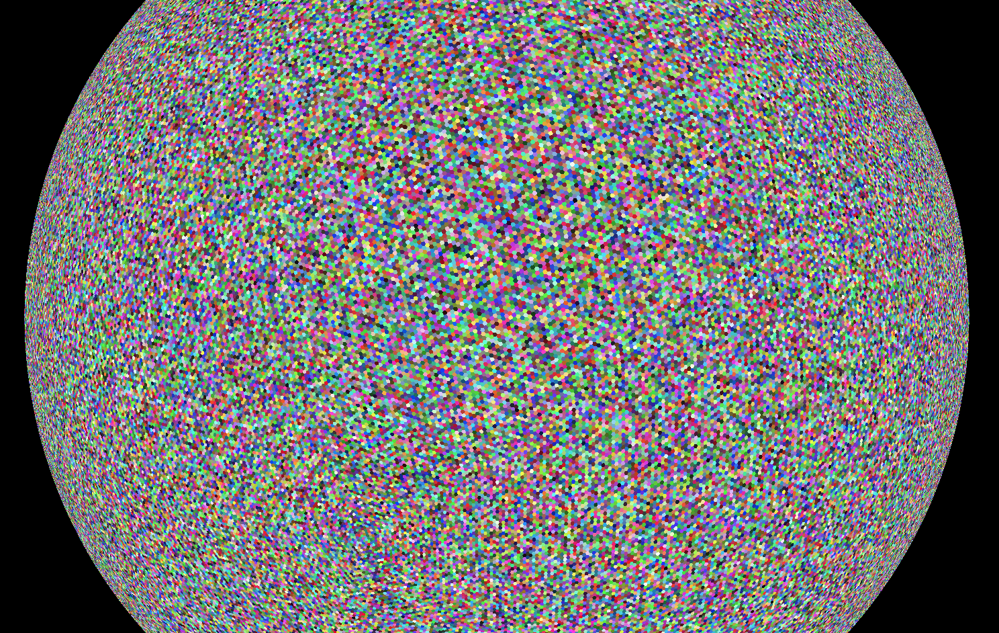

# Hexsphere Generator

Eventually, this will be a full-blown planet generator. But, for now, this is a 
hexsphere generator. This shape is also known as a [Goldberg 
polyhedron](https://en.wikipedia.org/wiki/Goldberg_polyhedron) or a [truncated 
icosahedron](https://en.wikipedia.org/wiki/Truncated_icosahedron). It is made 
from generating a [icosahedron](https://en.wikipedia.org/wiki/Icosahedron) which 
is split N times for a detail level of N. The [dual 
polyhedron](https://en.wikipedia.org/wiki/Dual_polyhedron) of that shape is 
calculated which results in the hexsphere. In its smallest form (detail level of 
0), it has 12 pentagon faces. As the detail level increases, it gains more 
hexagon faces and becomes more spherical in shape.

Detail level 0:

Detail level 8:

